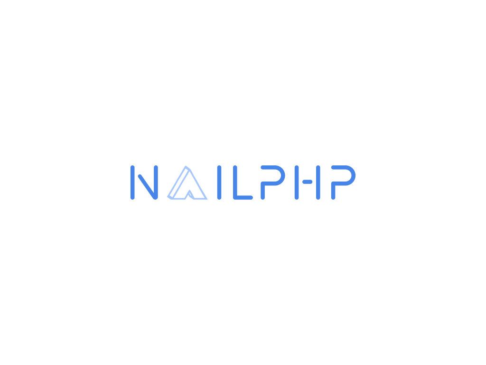

# NailPHP

NailPHP is an MVC PHP framework for web and console applications. Released under the MIT license.


### Installation

it requires PHP 7.2+ to run.

Install the dependencies.

```sh
$ composer create-project rfaiez/nailphp project
```

For starting the server

```sh
$ cd project
$ make serve
```

### Plugins

NailPHP is currently extended with the following plugins. Instructions on how to use them in your own application are linked below.

| Plugin | README |
| ------ | ------ |
| PHP Form Builder | https://github.com/anlutro/php-form/blob/master/README.md |
| Doctrine Annotations | https://github.com/doctrine/annotations/blob/1.11.x/README.md |
| Doctrine ORM | https://github.com/doctrine/orm/blob/2.8.x/README.md |
| EventDispatcher | https://github.com/Koriit/EventDispatcher/blob/master/README.md |
| FastRoute | https://github.com/nikic/FastRoute/blob/master/README.md |
| PHP-DI | https://github.com/PHP-DI/PHP-DI/blob/master/README.md |
| smarty | https://github.com/smarty-php/smarty/blob/master/README.md |
| Symfony console | https://github.com/symfony/console/blob/5.x/README.md |
| phpdotenv | https://github.com/vlucas/phpdotenv/blob/master/README.md |


### Development

To use console command Tab:

```sh
$ php bin/console <command>
```

And to display available command Tab:
```sh
$ php bin/console
```
 
 
 
 Or to use doctrine command Tab:
 ```sh
 $ php vendor/bin/doctrine <command>
 ```
 And to display available doctrine command Tab:
 ```sh
 $ php vendor/bin/doctrine
 ```

License
----

MIT

